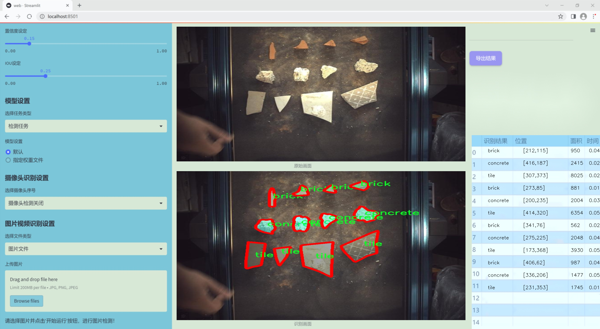
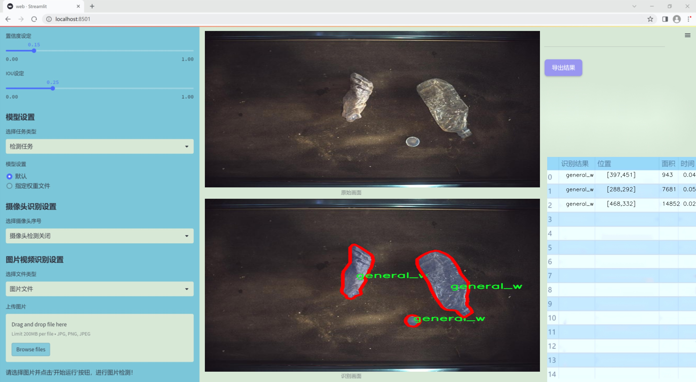
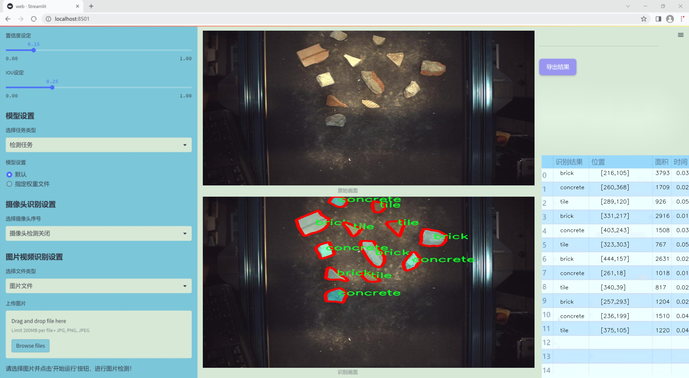
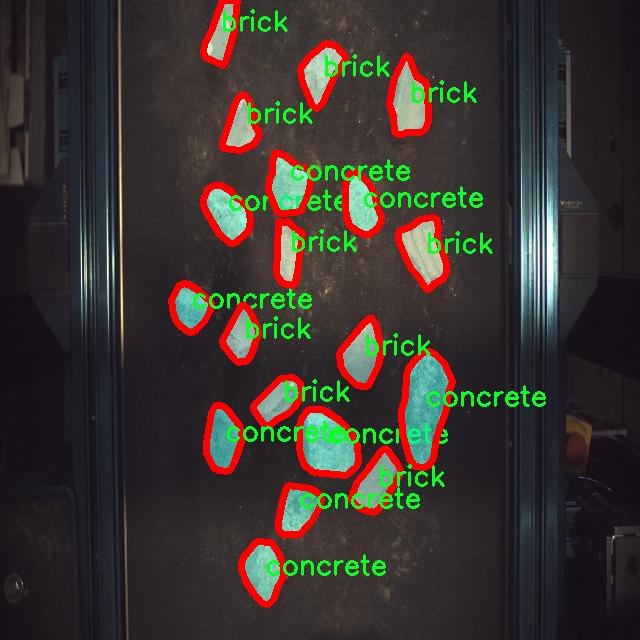
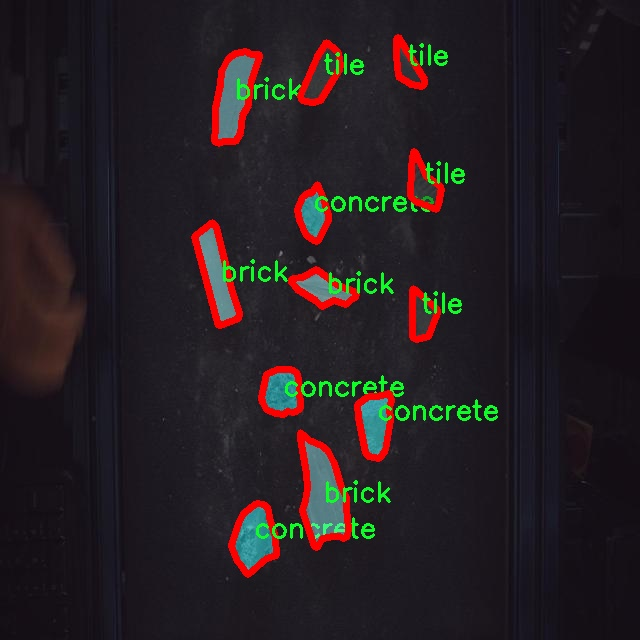
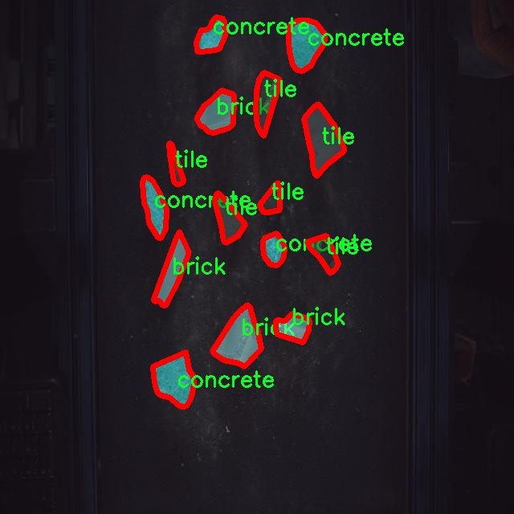
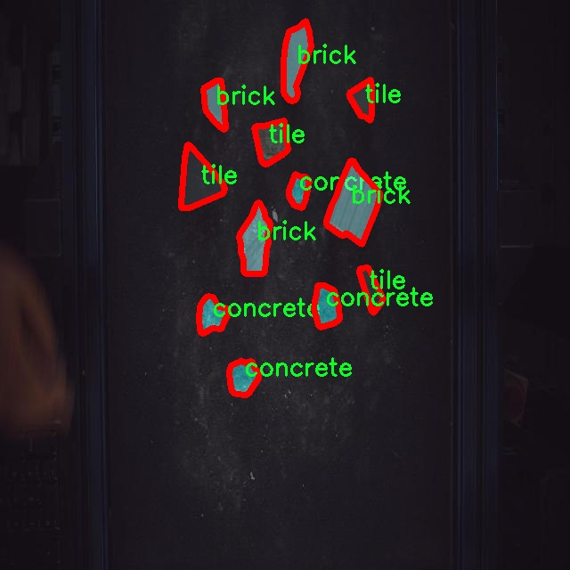
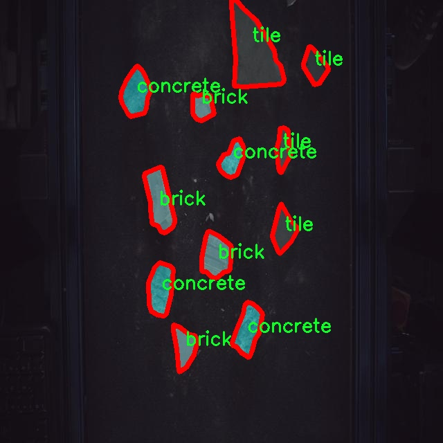

### 1.背景意义

研究背景与意义

随着建筑行业的快速发展，建筑材料的种类和应用场景日益丰富，如何高效、准确地识别和分类这些材料成为了一个亟待解决的问题。传统的人工识别方法不仅耗时耗力，而且容易受到人为因素的影响，导致识别结果的不准确。因此，基于计算机视觉的自动化识别系统应运而生，成为提升建筑材料管理效率的重要工具。

YOLO（You Only Look Once）系列模型因其高效的实时目标检测能力而广受欢迎。近年来，YOLOv11的推出进一步提升了目标检测的精度和速度，使其在复杂环境下的应用成为可能。本研究旨在基于改进的YOLOv11模型，构建一个高效的传送带建筑材料识别系统。该系统将利用包含3100张图像的CODD数据集，涵盖砖、混凝土、泡沫、石膏板、管道、塑料、石材、瓷砖和木材等10种建筑材料，进行实例分割和分类。

通过对数据集的深入分析与处理，系统将能够实现对建筑材料的快速识别和分类，进而为建筑施工、材料管理和资源调配提供有力支持。此外，基于深度学习的自动识别系统还将为建筑行业的数字化转型提供技术保障，推动智能建筑的实现。

本研究不仅具有重要的理论意义，能够丰富计算机视觉领域的研究成果，同时也具有广泛的应用前景，能够为建筑行业的智能化发展提供切实可行的解决方案。通过实现高效的建筑材料识别，能够有效降低人工成本，提高工作效率，推动建筑行业的可持续发展。

### 2.视频效果

[2.1 视频效果](https://www.bilibili.com/video/BV14xq3YLEZb/)

### 3.图片效果







##### [项目涉及的源码数据来源链接](https://kdocs.cn/l/cszuIiCKVNis)**

注意：本项目提供训练的数据集和训练教程,由于版本持续更新,暂不提供权重文件（best.pt）,请按照6.训练教程进行训练后实现上图演示的效果。

### 4.数据集信息

##### 4.1 本项目数据集类别数＆类别名

nc: 10
names: ['brick', 'concrete', 'foam', 'general_w', 'gypsum_board', 'pipes', 'plastic', 'stone', 'tile', 'wood']


该项目为【图像分割】数据集，请在【训练教程和Web端加载模型教程（第三步）】这一步的时候按照【图像分割】部分的教程来训练

##### 4.2 本项目数据集信息介绍

本项目数据集信息介绍

本项目旨在改进YOLOv11模型，以实现对传送带上建筑材料的高效识别。为此，我们构建了一个专门的数据集，涵盖了建筑材料的多种类别，以支持模型的训练和优化。该数据集的主题为“CODD”，意在为建筑行业提供更为智能化的材料识别解决方案。数据集中包含10个主要类别，具体包括砖块（brick）、混凝土（concrete）、泡沫（foam）、一般木材（general_w）、石膏板（gypsum_board）、管道（pipes）、塑料（plastic）、石材（stone）、瓷砖（tile）和木材（wood）。这些类别代表了在建筑施工和材料管理中常见的多种材料，具有广泛的应用价值。

在数据集的构建过程中，我们收集了大量的图像数据，确保每个类别的样本数量充足且多样化，以便模型能够学习到不同材料在各种环境和角度下的特征。每个类别的图像都经过精心标注，确保准确性和一致性，从而为模型的训练提供高质量的输入数据。此外，数据集还包含了不同光照条件、背景和材质的样本，以增强模型的鲁棒性，使其能够在实际应用中更好地适应各种复杂情况。

通过使用这一数据集，我们期望能够提升YOLOv11在建筑材料识别任务中的性能，使其在实时监测和自动化管理中发挥更大的作用。随着建筑行业对智能化和自动化需求的不断增加，开发出一个高效、准确的材料识别系统将为施工现场的管理和材料的使用效率带来显著的提升。因此，本项目的数据集不仅具有学术研究的价值，也为实际应用提供了重要的支持。











### 5.全套项目环境部署视频教程（零基础手把手教学）

[5.1 所需软件PyCharm和Anaconda安装教程（第一步）](https://www.bilibili.com/video/BV1BoC1YCEKi/?spm_id_from=333.999.0.0&vd_source=bc9aec86d164b67a7004b996143742dc)


[5.2 安装Python虚拟环境创建和依赖库安装视频教程（第二步）](https://www.bilibili.com/video/BV1ZoC1YCEBw?spm_id_from=333.788.videopod.sections&vd_source=bc9aec86d164b67a7004b996143742dc)

### 6.改进YOLOv11训练教程和Web_UI前端加载模型教程（零基础手把手教学）

[6.1 改进YOLOv11训练教程和Web_UI前端加载模型教程（第三步）](https://www.bilibili.com/video/BV1BoC1YCEhR?spm_id_from=333.788.videopod.sections&vd_source=bc9aec86d164b67a7004b996143742dc)


按照上面的训练视频教程链接加载项目提供的数据集，运行train.py即可开始训练



     Epoch   gpu_mem       box       obj       cls    labels  img_size
     1/200     20.8G   0.01576   0.01955  0.007536        22      1280: 100%|██████████| 849/849 [14:42<00:00,  1.04s/it]
               Class     Images     Labels          P          R     mAP@.5 mAP@.5:.95: 100%|██████████| 213/213 [01:14<00:00,  2.87it/s]
                 all       3395      17314      0.994      0.957      0.0957      0.0843

     Epoch   gpu_mem       box       obj       cls    labels  img_size
     2/200     20.8G   0.01578   0.01923  0.007006        22      1280: 100%|██████████| 849/849 [14:44<00:00,  1.04s/it]
               Class     Images     Labels          P          R     mAP@.5 mAP@.5:.95: 100%|██████████| 213/213 [01:12<00:00,  2.95it/s]
                 all       3395      17314      0.996      0.956      0.0957      0.0845

     Epoch   gpu_mem       box       obj       cls    labels  img_size
     3/200     20.8G   0.01561    0.0191  0.006895        27      1280: 100%|██████████| 849/849 [10:56<00:00,  1.29it/s]
               Class     Images     Labels          P          R     mAP@.5 mAP@.5:.95: 100%|███████   | 187/213 [00:52<00:00,  4.04it/s]
                 all       3395      17314      0.996      0.957      0.0957      0.0845


###### [项目数据集下载链接](https://kdocs.cn/l/cszuIiCKVNis)

### 7.原始YOLOv11算法讲解

YOLOv11是Ultralytics推出的YOLO系列最新版本，专为实现尖端的物体检测而设计。其架构和训练方法上进行了重大改进，使之不仅具备卓越的准确性和处理速度，还在计算效率上实现了一场革命。得益于其改进的主干和颈部架构，YOLOv11在特征提取和处理复杂任务时表现更加出色。在2024年9月27日，Ultralytics通过长达九小时的在线直播发布这一新作，展示了其在计算机视觉领域的革新。

YOLOv11通过精细的架构设计和优化训练流程，在保持高精度的同时，缩减了参数量，与YOLOv8m相比减少了22%的参数，使其在COCO数据集上的平均准确度（mAP）有所提升。这种效率的提高使YOLOv11非常适合部署在各种硬件环境中，包括边缘设备、云计算平台以及支持NVIDIA GPU的系统，确保在灵活性上的优势。

该模型支持广泛的任务，从对象检测、实例分割到图像分类、姿态估计和定向对象检测（OBB），几乎覆盖了计算机视觉的所有主要挑战。其创新的C3k2和C2PSA模块提升了网络深度和注意力机制的应用，提高了特征提取的效率和效果。同时，YOLOv11的改进网络结构也使之在复杂视觉任务上得以从容应对，成为各类计算机视觉任务的多功能选择。这些特性令YOLOv11在实施实时物体检测的各个领域中表现出众。
* * *

2024年9月27日，Ultralytics在线直播长达九小时，为YOLO11召开“发布会”

YOLO11 是 Ultralytics YOLO 系列实时物体检测器的最新版本，它以尖端的准确性、速度和效率重新定义了可能性。在之前 YOLO
版本的显著进步的基础上，YOLO11 在架构和训练方法方面进行了重大改进，使其成为各种计算机视觉任务的多功能选择。


##### YOLO11主要特点：

  * 增强的特征提取：YOLO11 采用了改进的主干和颈部架构，增强了特征提取能力，可实现更精确的对象检测和复杂任务性能。
  * 针对效率和速度进行了优化：YOLO11 引入了完善的架构设计和优化的训练流程，可提供更快的处理速度，并在准确度和性能之间保持最佳平衡。
  * 更少的参数，更高的准确度：借助模型设计的进步，YOLO11m 在 COCO 数据集上实现了更高的平均准确度 (mAP)，同时使用的参数比 YOLOv8m 少 22%，从而提高了计算效率，同时又不影响准确度。
  * 跨环境的适应性：YOLO11 可以无缝部署在各种环境中，包括边缘设备、云平台和支持 NVIDIA GPU 的系统，从而确保最大的灵活性。
  * 支持的任务范围广泛：无论是对象检测、实例分割、图像分类、姿势估计还是定向对象检测 (OBB)，YOLO11 都旨在满足各种计算机视觉挑战。

##### 支持的任务和模式

YOLO11 以 YOLOv8 中引入的多功能模型系列为基础，为各种计算机视觉任务提供增强的支持：

Model| Filenames| Task| Inference| Validation| Training| Export  
---|---|---|---|---|---|---  
YOLO11| yolol11n.pt, yolol11s.pt, yolol11m.pt, yolol11x.pt| Detection| ✅| ✅|
✅| ✅  
YOLO11-seg| yolol11n-seg.pt, yolol11s-seg.pt, yolol11m-seg.pt,
yolol11x-seg.pt| Instance Segmentation| ✅| ✅| ✅| ✅  
YOLO11-pose| yolol11n-pose.pt, yolol11s-pose.pt, yolol11m-pose.pt,
yolol11x-pose.pt| Pose/Keypoints| ✅| ✅| ✅| ✅  
YOLO11-obb| yolol11n-obb.pt, yolol11s-obb.pt, yolol11m-obb.pt,
yolol11x-obb.pt| Oriented Detection| ✅| ✅| ✅| ✅  
YOLO11-cls| yolol11n-cls.pt, yolol11s-cls.pt, yolol11m-cls.pt,
yolol11x-cls.pt| Classification| ✅| ✅| ✅| ✅  
  
##### 简单的 YOLO11 训练和推理示例

以下示例适用于用于对象检测的 YOLO11 Detect 模型。

    
    
    from ultralytics import YOLO
    
    # Load a model
    model = YOLO("yolo11n.pt")
    
    # Train the model
    train_results = model.train(
        data="coco8.yaml",  # path to dataset YAML
        epochs=100,  # number of training epochs
        imgsz=640,  # training image size
        device="cpu",  # device to run on, i.e. device=0 or device=0,1,2,3 or device=cpu
    )
    
    # Evaluate model performance on the validation set
    metrics = model.val()
    
    # Perform object detection on an image
    results = model("path/to/image.jpg")
    results[0].show()
    
    # Export the model to ONNX format
    path = model.export(format="onnx")  # return path to exported model

##### 支持部署于边缘设备

YOLO11 专为适应各种环境而设计，包括边缘设备。其优化的架构和高效的处理能力使其适合部署在边缘设备、云平台和支持 NVIDIA GPU
的系统上。这种灵活性确保 YOLO11 可用于各种应用，从移动设备上的实时检测到云环境中的复杂分割任务。有关部署选项的更多详细信息，请参阅导出文档。

##### YOLOv11 yaml文件

    
    
    # Ultralytics YOLO 🚀, AGPL-3.0 license
    # YOLO11 object detection model with P3-P5 outputs. For Usage examples see https://docs.ultralytics.com/tasks/detect
    
    # Parameters
    nc: 80 # number of classes
    scales: # model compound scaling constants, i.e. 'model=yolo11n.yaml' will call yolo11.yaml with scale 'n'
      # [depth, width, max_channels]
      n: [0.50, 0.25, 1024] # summary: 319 layers, 2624080 parameters, 2624064 gradients, 6.6 GFLOPs
      s: [0.50, 0.50, 1024] # summary: 319 layers, 9458752 parameters, 9458736 gradients, 21.7 GFLOPs
      m: [0.50, 1.00, 512] # summary: 409 layers, 20114688 parameters, 20114672 gradients, 68.5 GFLOPs
      l: [1.00, 1.00, 512] # summary: 631 layers, 25372160 parameters, 25372144 gradients, 87.6 GFLOPs
      x: [1.00, 1.50, 512] # summary: 631 layers, 56966176 parameters, 56966160 gradients, 196.0 GFLOPs
    
    # YOLO11n backbone
    backbone:
      # [from, repeats, module, args]
      - [-1, 1, Conv, [64, 3, 2]] # 0-P1/2
      - [-1, 1, Conv, [128, 3, 2]] # 1-P2/4
      - [-1, 2, C3k2, [256, False, 0.25]]
      - [-1, 1, Conv, [256, 3, 2]] # 3-P3/8
      - [-1, 2, C3k2, [512, False, 0.25]]
      - [-1, 1, Conv, [512, 3, 2]] # 5-P4/16
      - [-1, 2, C3k2, [512, True]]
      - [-1, 1, Conv, [1024, 3, 2]] # 7-P5/32
      - [-1, 2, C3k2, [1024, True]]
      - [-1, 1, SPPF, [1024, 5]] # 9
      - [-1, 2, C2PSA, [1024]] # 10
    
    # YOLO11n head
    head:
      - [-1, 1, nn.Upsample, [None, 2, "nearest"]]
      - [[-1, 6], 1, Concat, [1]] # cat backbone P4
      - [-1, 2, C3k2, [512, False]] # 13
    
      - [-1, 1, nn.Upsample, [None, 2, "nearest"]]
      - [[-1, 4], 1, Concat, [1]] # cat backbone P3
      - [-1, 2, C3k2, [256, False]] # 16 (P3/8-small)
    
      - [-1, 1, Conv, [256, 3, 2]]
      - [[-1, 13], 1, Concat, [1]] # cat head P4
      - [-1, 2, C3k2, [512, False]] # 19 (P4/16-medium)
    
      - [-1, 1, Conv, [512, 3, 2]]
      - [[-1, 10], 1, Concat, [1]] # cat head P5
      - [-1, 2, C3k2, [1024, True]] # 22 (P5/32-large)
    
      - [[16, 19, 22], 1, Detect, [nc]] # Detect(P3, P4, P5)
    

**YOLO11和YOLOv8 yaml文件的区别**


##### 改进模块代码

  * C3k2 

    
    
    class C3k2(C2f):
        """Faster Implementation of CSP Bottleneck with 2 convolutions."""
    
        def __init__(self, c1, c2, n=1, c3k=False, e=0.5, g=1, shortcut=True):
            """Initializes the C3k2 module, a faster CSP Bottleneck with 2 convolutions and optional C3k blocks."""
            super().__init__(c1, c2, n, shortcut, g, e)
            self.m = nn.ModuleList(
                C3k(self.c, self.c, 2, shortcut, g) if c3k else Bottleneck(self.c, self.c, shortcut, g) for _ in range(n)
            )

C3k2，它是具有两个卷积的CSP（Partial Cross Stage）瓶颈架构的更快实现。

**类继承：**

  * `C3k2`继承自类`C2f`。这表明`C2f`很可能实现了经过修改的基本CSP结构，而`C3k2`进一步优化或修改了此结构。

**构造函数（`__init__`）：**

  * `c1`：输入通道。

  * `c2`：输出通道。

  * `n`：瓶颈层数（默认为1）。

  * `c3k`：一个布尔标志，确定是否使用`C3k`块或常规`Bottleneck`块。

  * `e`：扩展比率，控制隐藏层的宽度（默认为0.5）。

  * `g`：分组卷积的组归一化参数或组数（默认值为 1）。

  * `shortcut`：一个布尔值，用于确定是否在网络中包含快捷方式连接（默认值为 `True`）。

**初始化：**

  * `super().__init__(c1, c2, n, short-cut, g, e)` 调用父类 `C2f` 的构造函数，初始化标准 CSP 组件，如通道数、快捷方式、组等。

**模块列表（`self.m`）：**

  * `nn.ModuleList` 存储 `C3k` 或 `Bottleneck` 模块，具体取决于 `c3k` 的值。

  * 如果 `c3k` 为 `True`，它会初始化 `C3k` 模块。`C3k` 模块接收以下参数：

  * `self.c`：通道数（源自 `C2f`）。

  * `2`：这表示在 `C3k` 块内使用了两个卷积层。

  * `shortcut` 和 `g`：从 `C3k2` 构造函数传递。

  * 如果 `c3k` 为 `False`，则初始化标准 `Bottleneck` 模块。

`for _ in range(n)` 表示将创建 `n` 个这样的块。

**总结：**

  * `C3k2` 实现了 CSP 瓶颈架构，可以选择使用自定义 `C3k` 块（具有两个卷积）或标准 `Bottleneck` 块，具体取决于 `c3k` 标志。

  * C2PSA

    
    
    class C2PSA(nn.Module):
        """
        C2PSA module with attention mechanism for enhanced feature extraction and processing.
    
        This module implements a convolutional block with attention mechanisms to enhance feature extraction and processing
        capabilities. It includes a series of PSABlock modules for self-attention and feed-forward operations.
    
        Attributes:
            c (int): Number of hidden channels.
            cv1 (Conv): 1x1 convolution layer to reduce the number of input channels to 2*c.
            cv2 (Conv): 1x1 convolution layer to reduce the number of output channels to c.
            m (nn.Sequential): Sequential container of PSABlock modules for attention and feed-forward operations.
    
        Methods:
            forward: Performs a forward pass through the C2PSA module, applying attention and feed-forward operations.
    
        Notes:
            This module essentially is the same as PSA module, but refactored to allow stacking more PSABlock modules.
    
        Examples:
            >>> c2psa = C2PSA(c1=256, c2=256, n=3, e=0.5)
            >>> input_tensor = torch.randn(1, 256, 64, 64)
            >>> output_tensor = c2psa(input_tensor)
        """
    
        def __init__(self, c1, c2, n=1, e=0.5):
            """Initializes the C2PSA module with specified input/output channels, number of layers, and expansion ratio."""
            super().__init__()
            assert c1 == c2
            self.c = int(c1 * e)
            self.cv1 = Conv(c1, 2 * self.c, 1, 1)
            self.cv2 = Conv(2 * self.c, c1, 1)
    
            self.m = nn.Sequential(*(PSABlock(self.c, attn_ratio=0.5, num_heads=self.c // 64) for _ in range(n)))
    
        def forward(self, x):
            """Processes the input tensor 'x' through a series of PSA blocks and returns the transformed tensor."""
            a, b = self.cv1(x).split((self.c, self.c), dim=1)
            b = self.m(b)
            return self.cv2(torch.cat((a, b), 1))

`C2PSA` 模块是一个自定义神经网络层，带有注意力机制，用于增强特征提取和处理。

**类概述**

  * **目的：**

  * `C2PSA` 模块引入了一个卷积块，利用注意力机制来改进特征提取和处理。

  * 它使用一系列 `PSABlock` 模块，这些模块可能代表某种形式的位置自注意力 (PSA)，并且该架构旨在允许堆叠多个 `PSABlock` 层。

**构造函数（`__init__`）：**

  * **参数：**

  * `c1`：输入通道（必须等于 `c2`）。

  * `c2`：输出通道（必须等于 `c1`）。

  * `n`：要堆叠的 `PSABlock` 模块数量（默认值为 1）。

  * `e`：扩展比率，用于计算隐藏通道的数量（默认值为 0.5）。

  * **属性：**

  * `self.c`：隐藏通道数，计算为 `int(c1 * e)`。

  * `self.cv1`：一个 `1x1` 卷积，将输入通道数从 `c1` 减少到 `2 * self.c`。这为将输入分成两部分做好准备。

  * `self.cv2`：另一个 `1x1` 卷积，处理后将通道维度恢复回 `c1`。

  * `self.m`：一系列 `PSABlock` 模块。每个 `PSABlock` 接收 `self.c` 通道，注意头的数量为 `self.c // 64`。每个块应用注意和前馈操作。

**前向方法：**

  * **输入：**

  * `x`，输入张量。

  * **操作：**

  1. `self.cv1(x)` 应用 `1x1` 卷积，将输入通道大小从 `c1` 减小到 `2 * self.c`。

  2. 生成的张量沿通道维度分为两部分，`a` 和 `b`。

  * `a`：第一个 `self.c` 通道。

  * `b`：剩余的 `self.c` 通道。

  1. `b` 通过顺序容器 `self.m`，它是 `PSABlock` 模块的堆栈。这部分经过基于注意的处理。

  2. 处理后的张量 `b` 与 `a` 连接。

  3. `self.cv2` 应用 `1x1` 卷积，将通道大小恢复为 `c1`。

  * **输出：**

  * 应用注意和卷积操作后的变换后的张量。

**总结：**

  * **C2PSA** 是一个增强型卷积模块，它通过堆叠的 `PSABlock` 模块应用位置自注意力。它拆分输入张量，将注意力应用于其中一部分，然后重新组合并通过最终卷积对其进行处理。此结构有助于从输入数据中提取复杂特征。

##### 网络结构


### 8.200+种全套改进YOLOV11创新点原理讲解

#### 8.1 200+种全套改进YOLOV11创新点原理讲解大全

由于篇幅限制，每个创新点的具体原理讲解就不全部展开，具体见下列网址中的改进模块对应项目的技术原理博客网址【Blog】（创新点均为模块化搭建，原理适配YOLOv5~YOLOv11等各种版本）

[改进模块技术原理博客【Blog】网址链接](https://gitee.com/qunmasj/good)


#### 8.2 精选部分改进YOLOV11创新点原理讲解

###### 这里节选部分改进创新点展开原理讲解(完整的改进原理见上图和[改进模块技术原理博客链接](https://gitee.com/qunmasj/good)【如果此小节的图加载失败可以通过CSDN或者Github搜索该博客的标题访问原始博客，原始博客图片显示正常】


### Context_Grided_Network(CGNet)简介
参考该博客提出的一种轻量化语义分割模型Context Grided Network(CGNet)，以满足设备的运行需要。

CGNet主要由CG块构建而成，CG块可以学习局部特征和周围环境上下文的联合特征，最后通过引入全局上下文特征进一步改善联合特征的学习。


 
下图给出了在Cityscapes数据集上对现有的一些语义分割模型的测试效果，横轴表示参数量，纵轴表示准确率(mIoU)。可以看出，在参数量较少的情况下，CGNet可以达到一个比较好的准确率。虽与高精度模型相去甚远，但在一些对精度要求不高、对实时性要求比较苛刻的情况下，很有价值。


高精度模型，如DeepLab、DFN、DenseASPP等，动不动就是几十M的参数，很难应用在移动设备上。而上图中红色的模型，相对内存占用较小，但它们的分割精度却不是很高。作者认为主要原因是，这些小网络大多遵循着分类网络的设计思路，并没有考虑语义分割任务更深层次的特点。

空间依赖性和上下文信息对提高分割精度有很大的作用。作者从该角度出发，提出了CG block，并进一步搭建了轻量级语义分割网络CGNet。CG块具有以下特点： 

学习局部特征和上下文特征的联合特征；
通过全局上下文特征改进上述联合特征；
可以贯穿应用在整个网络中，从low level（空间级别）到high level（语义级别）。不像PSPNet、DFN、DenseASPP等，只在编码阶段以后捕捉上下文特征。；
只有3个下采样，相比一般5个下采样的网络，能够更好地保留边缘信息。
CGNet遵循“深而薄”的原则设计，整个网络又51层构成。其中，为了降低计算，大量使用了channel-wise conv.

小型语义分割模型：

需要平衡准确率和系统开销
进化路线：ENet -> ICNet -> ESPNet
这些模型基本都基于分类网络设计，在分割准确率上效果并不是很好
上下文信息模型：

大多数现有模型只考虑解码阶段的上下文信息并且没有利用周围的上下文信息
注意力机制：

CG block使用全局上下文信息计算权重向量，并使用其细化局部特征和周围上下文特征的联合特征

#### Context Guided Block
CG block由4部分组成：


此外，CG block还采用了残差学习。文中提出了局部残差学习（LRL）和全局残差学习（GRL）两种方式。 LRL添加了从输入到联合特征提取器的连接，GRL添加了从输入到全局特征提取器的连接。从直观上来说，GRL比LRL更能促进网络中的信息传递（更像ResNet~~），后面实验部分也进行了测试，的确GRL更能提升分割精度。


CGNet的通用网络结构如下图所示，分为3个stage，第一个stage使用3个卷积层抽取特征，第二和第三个stage堆叠一定数量的CG block，具体个数可以根据情况调整。最后，通过1x1 conv得到分割结果。


下图是用于Cityscapes数据集的CGNet网络细节说明：输入尺寸为3*680*680；stage1连续使用了3个Conv-BN-PReLU组合，首个组合使用了stride=2的卷积，所以得到了1/2分辨率的feature map；stage2和stage3分别使用了多个CG block，且其中使用了不同大小的膨胀卷积核，最终分别得到了1/4和1/8的feature map。

需注意：

stage2&3的输入特征分别由其上一个stage的首个和最后一个block组合给出（参考上图的绿色箭头）；

输入注入机制，图中未体现，实际使用中，作者还将输入图像下采样1/4或1/8，分别给到stage2和stage3的输入中 ，以进一步加强特征传递。

channel-wise conv。为了缩减参数数量，在局部特征提取器和周围上下文特征提取器中使用了channel-wise卷积，可以消除跨通道的计算成本，同时节省内存占用。但是，没有像MobileNet等模型一样，在depth-wise卷积后面接point-wise卷积（1*1 conv），作者解释是，因为CG block需要保持局部特征和周围上下文特征的独立性，而1*1 conv会破坏这种独立性，所以效果欠佳，实验部分也进行了验证。

个人感觉此处应该指的是depth-wise卷积？

官方Git中对该部分的实现如下：


### 9.系统功能展示

图9.1.系统支持检测结果表格显示

  图9.2.系统支持置信度和IOU阈值手动调节

  图9.3.系统支持自定义加载权重文件best.pt(需要你通过步骤5中训练获得)

  图9.4.系统支持摄像头实时识别

  图9.5.系统支持图片识别

  图9.6.系统支持视频识别

  图9.7.系统支持识别结果文件自动保存

  图9.8.系统支持Excel导出检测结果数据


### 10. YOLOv11核心改进源码讲解

#### 10.1 mamba_vss.py

下面是对给定代码的核心部分进行提炼和详细注释的结果：

```python
import torch
import torch.nn as nn
import torch.nn.functional as F
from einops import repeat
from functools import partial

class SS2D(nn.Module):
    def __init__(self, d_model, d_state=16, d_conv=3, expand=2, dropout=0., device=None, dtype=None):
        super().__init__()
        # 模型参数初始化
        self.d_model = d_model  # 输入特征维度
        self.d_state = d_state  # 状态维度
        self.d_inner = expand * d_model  # 内部特征维度
        self.in_proj = nn.Linear(d_model, self.d_inner * 2)  # 输入投影层
        self.conv2d = nn.Conv2d(in_channels=self.d_inner, out_channels=self.d_inner, groups=self.d_inner, kernel_size=d_conv, padding=(d_conv - 1) // 2)  # 卷积层
        self.act = nn.SiLU()  # 激活函数
        self.out_norm = nn.LayerNorm(self.d_inner)  # 输出归一化层
        self.out_proj = nn.Linear(self.d_inner, d_model)  # 输出投影层
        self.dropout = nn.Dropout(dropout) if dropout > 0. else None  # Dropout层

    def forward(self, x: torch.Tensor):
        # 前向传播
        B, H, W, C = x.shape  # 获取输入的形状
        xz = self.in_proj(x)  # 输入投影
        x, z = xz.chunk(2, dim=-1)  # 分割投影结果
        x = x.permute(0, 3, 1, 2).contiguous()  # 调整维度顺序
        x = self.act(self.conv2d(x))  # 卷积和激活
        y = self.forward_core(x)  # 核心前向计算
        y = y * F.silu(z)  # 结合状态信息
        out = self.out_proj(y)  # 输出投影
        if self.dropout is not None:
            out = self.dropout(out)  # 应用Dropout
        return out

    def forward_core(self, x: torch.Tensor):
        # 核心前向计算
        B, C, H, W = x.shape
        L = H * W  # 计算总的空间维度
        K = 4  # 固定的分支数

        # 处理输入
        x_hwwh = torch.stack([x.view(B, -1, L), torch.transpose(x, dim0=2, dim1=3).contiguous().view(B, -1, L)], dim=1).view(B, 2, -1, L)
        xs = torch.cat([x_hwwh, torch.flip(x_hwwh, dims=[-1])], dim=1)  # 生成反向输入

        # 计算状态和时间步长
        dts, Bs, Cs = torch.split(xs, [self.dt_rank, self.d_state, self.d_state], dim=2)
        # 进行选择性扫描
        out_y = self.selective_scan(xs, dts, As, Bs, Cs, Ds, z=None)

        # 处理输出
        y = out_y[:, 0] + out_y[:, 1] + out_y[:, 2] + out_y[:, 3]
        y = torch.transpose(y, dim0=1, dim1=2).contiguous().view(B, H, W, -1)
        y = self.out_norm(y)  # 归一化
        return y

class VSSBlock(nn.Module):
    def __init__(self, hidden_dim: int = 0, drop_path: float = 0.2, d_state: int = 16):
        super().__init__()
        self.ln_1 = nn.LayerNorm(hidden_dim)  # 归一化层
        self.self_attention = SS2D(d_model=hidden_dim, d_state=d_state)  # 自注意力层
        self.drop_path = nn.Dropout(drop_path)  # DropPath层

    def forward(self, input: torch.Tensor):
        input = input.permute((0, 2, 3, 1))  # 调整输入维度
        x = input + self.drop_path(self.self_attention(self.ln_1(input)))  # 残差连接
        return x.permute((0, 3, 1, 2))  # 恢复维度顺序

class Mamba2Block(VSSBlock):
    def __init__(self, hidden_dim: int = 0, drop_path: float = 0.2, d_state: int = 16):
        super().__init__(hidden_dim, drop_path, d_state)
        self.self_attention = Mamba2Simple(d_model=hidden_dim, d_state=d_state)  # 使用Mamba2Simple作为自注意力层

    def forward(self, input: torch.Tensor):
        B, C, W, H = input.size()
        input = input.permute((0, 2, 3, 1))  # 调整输入维度
        ln = self.ln_1(input).reshape(B, W * H, C).contiguous()  # 归一化并调整形状
        x = input + self.drop_path(self.self_attention(ln)).reshape((B, W, H, C))  # 残差连接
        return x.permute((0, 3, 1, 2))  # 恢复维度顺序

if __name__ == '__main__':
    # 测试代码
    inputs = torch.randn((1, 64, 32, 32)).cuda()  # 随机输入
    model = VSSBlock(64).cuda()  # 实例化VSSBlock
    pred = model(inputs)  # 前向传播
    print(pred.size())  # 输出预测结果的尺寸
    
    inputs = torch.randn((1, 64, 32, 32)).cuda()  # 随机输入
    model = Mamba2Block(64, d_state=64).cuda()  # 实例化Mamba2Block
    pred = model(inputs)  # 前向传播
    print(pred.size())  # 输出预测结果的尺寸
```

### 代码核心部分解释
1. **SS2D类**: 这是一个自定义的神经网络模块，包含输入投影、卷积层、激活函数、输出投影等。其核心功能是处理输入特征并通过选择性扫描机制进行状态更新。

2. **VSSBlock类**: 这是一个包含自注意力机制的模块，利用`SS2D`类进行特征提取，并通过残差连接增强模型的表达能力。

3. **Mamba2Block类**: 继承自`VSSBlock`，使用`Mamba2Simple`作为自注意力层，进一步增强模型的复杂性和表现力。

4. **前向传播**: 每个模块的`forward`方法实现了数据的流动，包括输入的调整、特征提取、激活、归一化和输出的生成。

5. **测试代码**: 在`__main__`部分，随机生成输入数据并通过模型进行前向传播，输出结果的尺寸以验证模型的正确性。

这个程序文件 `mamba_vss.py` 实现了一个深度学习模型的模块，主要包括了两个类：`SS2D` 和 `VSSBlock`，以及一个继承自 `VSSBlock` 的 `Mamba2Block`。这些模块主要用于构建具有自注意力机制的神经网络，特别是在处理图像数据时。

首先，`SS2D` 类是一个核心模块，它的构造函数接收多个参数，包括模型的维度、状态维度、卷积核大小、扩展因子等。这个类的主要功能是实现一种特殊的自注意力机制，利用了深度学习中的线性层和卷积层。它通过输入投影、卷积操作和多种线性变换来处理输入数据，并在前向传播中使用选择性扫描（`selective_scan_fn`）来高效地计算状态更新。

在 `SS2D` 的 `forward` 方法中，输入数据首先经过线性投影，然后通过卷积层进行处理。接着，经过一系列的张量操作和线性变换，最终生成输出。这里的 `forward_core` 方法是实现选择性扫描的核心逻辑，它通过一系列的张量操作来计算输出，利用了 `torch.einsum` 进行高效的张量乘法。

接下来，`VSSBlock` 类是一个更高层次的模块，它集成了 `SS2D` 模块，并添加了层归一化和残差连接。它的构造函数中接收隐藏层维度、丢弃路径率等参数，并在前向传播中将输入数据进行归一化、经过自注意力模块处理后再与原输入相加，形成残差连接。这种结构有助于提高模型的训练效果和稳定性。

`Mamba2Block` 类是 `VSSBlock` 的一个扩展，主要通过替换自注意力模块为 `Mamba2Simple` 来实现更复杂的注意力机制。它的前向传播逻辑与 `VSSBlock` 类似，但在自注意力的实现上有所不同。

最后，在文件的主程序部分，创建了随机输入数据，并实例化了 `VSSBlock` 和 `Mamba2Block`，然后通过这些模型进行前向传播，输出预测结果的尺寸。这部分代码用于测试模型的基本功能，确保在给定输入时能够正确返回输出。

总体来说，这个文件实现了一个基于自注意力机制的深度学习模块，适用于图像处理任务，具有良好的扩展性和灵活性。

#### 10.2 kagn_conv.py

以下是经过简化并添加详细中文注释的核心代码部分：

```python
import torch
import torch.nn as nn
from functools import lru_cache

class KAGNConvNDLayer(nn.Module):
    def __init__(self, conv_class, norm_class, conv_w_fun, input_dim, output_dim, degree, kernel_size,
                 groups=1, padding=0, stride=1, dilation=1, dropout: float = 0.0, ndim: int = 2):
        super(KAGNConvNDLayer, self).__init__()
        
        # 初始化参数
        self.inputdim = input_dim  # 输入维度
        self.outdim = output_dim    # 输出维度
        self.degree = degree         # 多项式的度数
        self.kernel_size = kernel_size  # 卷积核大小
        self.padding = padding       # 填充
        self.stride = stride         # 步幅
        self.dilation = dilation     # 膨胀
        self.groups = groups         # 分组卷积的组数
        self.base_activation = nn.SiLU()  # 基础激活函数
        self.conv_w_fun = conv_w_fun  # 卷积权重函数
        self.ndim = ndim             # 数据的维度
        self.dropout = nn.Dropout2d(p=dropout) if ndim == 2 else None  # Dropout层
        
        # 检查分组卷积的有效性
        if groups <= 0 or input_dim % groups != 0 or output_dim % groups != 0:
            raise ValueError('groups must be a positive integer and input/output dimensions must be divisible by groups')

        # 创建基础卷积层和归一化层
        self.base_conv = nn.ModuleList([conv_class(input_dim // groups, output_dim // groups, kernel_size, stride, padding, dilation, groups=1, bias=False) for _ in range(groups)])
        self.layer_norm = nn.ModuleList([norm_class(output_dim // groups) for _ in range(groups)])

        # 初始化多项式权重
        poly_shape = (groups, output_dim // groups, (input_dim // groups) * (degree + 1)) + (kernel_size,) * ndim
        self.poly_weights = nn.Parameter(torch.randn(*poly_shape))  # 多项式权重
        self.beta_weights = nn.Parameter(torch.zeros(degree + 1, dtype=torch.float32))  # beta权重

        # 使用Kaiming均匀分布初始化卷积层权重
        for conv_layer in self.base_conv:
            nn.init.kaiming_uniform_(conv_layer.weight, nonlinearity='linear')
        nn.init.kaiming_uniform_(self.poly_weights, nonlinearity='linear')
        nn.init.normal_(self.beta_weights, mean=0.0, std=1.0 / ((kernel_size ** ndim) * self.inputdim * (self.degree + 1.0)))

    def beta(self, n, m):
        # 计算beta值
        return (((m + n) * (m - n) * n ** 2) / (m ** 2 / (4.0 * n ** 2 - 1.0))) * self.beta_weights[n]

    @lru_cache(maxsize=128)  # 使用缓存避免重复计算
    def gram_poly(self, x, degree):
        # 计算Legendre多项式
        p0 = x.new_ones(x.size())  # p0初始化为1
        if degree == 0:
            return p0.unsqueeze(-1)  # 如果度数为0，返回p0

        p1 = x  # p1初始化为x
        grams_basis = [p0, p1]  # 存储多项式基

        for i in range(2, degree + 1):
            p2 = x * p1 - self.beta(i - 1, i) * p0  # 递归计算多项式
            grams_basis.append(p2)
            p0, p1 = p1, p2  # 更新p0和p1

        return torch.cat(grams_basis, dim=1)  # 合并多项式基

    def forward_kag(self, x, group_index):
        # 前向传播，处理每个组的输入
        basis = self.base_conv[group_index](self.base_activation(x))  # 通过基础卷积层
        x = torch.tanh(x).contiguous()  # 对输入进行tanh归一化

        if self.dropout is not None:
            x = self.dropout(x)  # 应用dropout

        grams_basis = self.base_activation(self.gram_poly(x, self.degree))  # 计算多项式基
        y = self.conv_w_fun(grams_basis, self.poly_weights[group_index], stride=self.stride, dilation=self.dilation, padding=self.padding, groups=1)  # 计算卷积输出
        y = self.base_activation(self.layer_norm[group_index](y + basis))  # 归一化并激活

        return y

    def forward(self, x):
        # 整体前向传播
        split_x = torch.split(x, self.inputdim // self.groups, dim=1)  # 按组分割输入
        output = []
        for group_ind, _x in enumerate(split_x):
            y = self.forward_kag(_x.clone(), group_ind)  # 处理每个组
            output.append(y.clone())
        y = torch.cat(output, dim=1)  # 合并输出
        return y
```

### 代码说明：
1. **KAGNConvNDLayer类**：这是一个通用的N维卷积层，支持不同维度的卷积操作（1D、2D、3D）。
2. **初始化方法**：初始化输入输出维度、卷积参数、激活函数、分组卷积等，并检查参数的有效性。
3. **beta方法**：计算与Legendre多项式相关的beta值。
4. **gram_poly方法**：计算Legendre多项式的基。
5. **forward_kag方法**：处理每个组的前向传播，计算卷积输出。
6. **forward方法**：实现整体的前向传播，处理分组输入并合并输出。

这个程序文件 `kagn_conv.py` 定义了一个名为 `KAGNConvNDLayer` 的神经网络层，旨在实现一种基于Legendre多项式的卷积操作。该层可以处理不同维度的输入数据，具体实现了1D、2D和3D卷积的子类。以下是对代码的详细讲解。

首先，程序导入了必要的库，包括 `torch` 和 `torch.nn`，以及一些卷积操作的函数。`KAGNConvNDLayer` 类继承自 `nn.Module`，是所有卷积层的基类。它的构造函数接受多个参数，包括输入和输出维度、卷积核大小、分组数、填充、步幅、扩张率、丢弃率等。构造函数中还定义了激活函数（使用SiLU激活函数）和丢弃层（如果丢弃率大于0）。

在构造函数中，程序首先进行了一些输入参数的验证，例如分组数必须为正整数，输入和输出维度必须能够被分组数整除。接着，程序创建了基础卷积层和归一化层的模块列表，这些层的数量与分组数相同。然后，程序初始化了一些多项式权重和β权重，使用Kaiming均匀分布进行初始化，以帮助网络更好地训练。

`beta` 方法计算给定的n和m的β值，这是Legendre多项式计算中的一个重要部分。`gram_poly` 方法使用递归的方式计算Legendre多项式，并使用LRU缓存来避免重复计算，提高效率。

`forward_kag` 方法是该层的核心计算逻辑。它首先对输入应用基础激活函数，然后进行线性变换。接着，将输入归一化到[-1, 1]的范围，以便于计算Legendre多项式。然后，计算多项式基，并通过卷积函数与多项式权重进行卷积操作，最后进行归一化和激活。

`forward` 方法负责处理输入数据。它将输入按组分割，然后对每个组调用 `forward_kag` 方法进行处理，最后将所有组的输出拼接在一起。

接下来的三个类 `KAGNConv3DLayer`、`KAGNConv2DLayer` 和 `KAGNConv1DLayer` 分别继承自 `KAGNConvNDLayer`，用于实现3D、2D和1D卷积操作。它们在构造函数中调用父类的构造函数，并传入相应的卷积和归一化层。

总的来说，这个程序文件实现了一种灵活的卷积层，能够处理不同维度的输入数据，并结合了Legendre多项式的特性，适用于需要复杂特征提取的深度学习任务。

#### 10.3 lsknet.py

以下是经过简化和注释的核心代码部分：

```python
import torch
import torch.nn as nn
from functools import partial

class Mlp(nn.Module):
    """ 多层感知机模块 """
    def __init__(self, in_features, hidden_features=None, out_features=None, act_layer=nn.GELU, drop=0.):
        super().__init__()
        out_features = out_features or in_features  # 输出特征数
        hidden_features = hidden_features or in_features  # 隐藏层特征数
        self.fc1 = nn.Conv2d(in_features, hidden_features, 1)  # 第一层卷积
        self.dwconv = DWConv(hidden_features)  # 深度卷积
        self.act = act_layer()  # 激活函数
        self.fc2 = nn.Conv2d(hidden_features, out_features, 1)  # 第二层卷积
        self.drop = nn.Dropout(drop)  # Dropout层

    def forward(self, x):
        """ 前向传播 """
        x = self.fc1(x)
        x = self.dwconv(x)
        x = self.act(x)
        x = self.drop(x)
        x = self.fc2(x)
        x = self.drop(x)
        return x


class LSKblock(nn.Module):
    """ LSK模块 """
    def __init__(self, dim):
        super().__init__()
        self.conv0 = nn.Conv2d(dim, dim, 5, padding=2, groups=dim)  # 深度卷积
        self.conv_spatial = nn.Conv2d(dim, dim, 7, stride=1, padding=9, groups=dim, dilation=3)  # 空间卷积
        self.conv1 = nn.Conv2d(dim, dim//2, 1)  # 1x1卷积
        self.conv2 = nn.Conv2d(dim, dim//2, 1)  # 1x1卷积
        self.conv_squeeze = nn.Conv2d(2, 2, 7, padding=3)  # 压缩卷积
        self.conv = nn.Conv2d(dim//2, dim, 1)  # 1x1卷积

    def forward(self, x):   
        attn1 = self.conv0(x)  # 第一个注意力分支
        attn2 = self.conv_spatial(attn1)  # 第二个注意力分支

        attn1 = self.conv1(attn1)  # 处理第一个分支
        attn2 = self.conv2(attn2)  # 处理第二个分支
        
        attn = torch.cat([attn1, attn2], dim=1)  # 拼接两个分支
        avg_attn = torch.mean(attn, dim=1, keepdim=True)  # 平均注意力
        max_attn, _ = torch.max(attn, dim=1, keepdim=True)  # 最大注意力
        agg = torch.cat([avg_attn, max_attn], dim=1)  # 拼接平均和最大注意力
        sig = self.conv_squeeze(agg).sigmoid()  # Sigmoid激活
        attn = attn1 * sig[:,0,:,:].unsqueeze(1) + attn2 * sig[:,1,:,:].unsqueeze(1)  # 加权组合
        attn = self.conv(attn)  # 最终卷积
        return x * attn  # 通过注意力加权输入


class Attention(nn.Module):
    """ 注意力模块 """
    def __init__(self, d_model):
        super().__init__()
        self.proj_1 = nn.Conv2d(d_model, d_model, 1)  # 投影层
        self.activation = nn.GELU()  # 激活函数
        self.spatial_gating_unit = LSKblock(d_model)  # 空间门控单元
        self.proj_2 = nn.Conv2d(d_model, d_model, 1)  # 反投影层

    def forward(self, x):
        shorcut = x.clone()  # 残差连接
        x = self.proj_1(x)
        x = self.activation(x)
        x = self.spatial_gating_unit(x)
        x = self.proj_2(x)
        x = x + shorcut  # 添加残差
        return x


class Block(nn.Module):
    """ 网络块，包含注意力和MLP """
    def __init__(self, dim, mlp_ratio=4., drop=0., drop_path=0., act_layer=nn.GELU):
        super().__init__()
        self.norm1 = nn.BatchNorm2d(dim)  # 归一化层
        self.norm2 = nn.BatchNorm2d(dim)  # 归一化层
        self.attn = Attention(dim)  # 注意力模块
        self.drop_path = nn.Identity() if drop_path <= 0. else DropPath(drop_path)  # 随机深度
        mlp_hidden_dim = int(dim * mlp_ratio)  # MLP隐藏层维度
        self.mlp = Mlp(in_features=dim, hidden_features=mlp_hidden_dim, act_layer=act_layer, drop=drop)  # MLP模块

    def forward(self, x):
        """ 前向传播 """
        x = x + self.drop_path(self.attn(self.norm1(x)))  # 注意力
        x = x + self.drop_path(self.mlp(self.norm2(x)))  # MLP
        return x


class LSKNet(nn.Module):
    """ LSK网络 """
    def __init__(self, img_size=224, in_chans=3, embed_dims=[64, 128, 256, 512], depths=[3, 4, 6, 3]):
        super().__init__()
        self.num_stages = len(depths)  # 网络阶段数

        for i in range(self.num_stages):
            # 每个阶段的嵌入层和块
            patch_embed = OverlapPatchEmbed(img_size=img_size // (2 ** i), in_chans=in_chans if i == 0 else embed_dims[i - 1], embed_dim=embed_dims[i])
            block = nn.ModuleList([Block(dim=embed_dims[i]) for _ in range(depths[i])])  # 每个阶段的块
            norm = nn.BatchNorm2d(embed_dims[i])  # 归一化层

            setattr(self, f"patch_embed{i + 1}", patch_embed)
            setattr(self, f"block{i + 1}", block)
            setattr(self, f"norm{i + 1}", norm)

    def forward(self, x):
        """ 前向传播 """
        outs = []
        for i in range(self.num_stages):
            patch_embed = getattr(self, f"patch_embed{i + 1}")
            block = getattr(self, f"block{i + 1}")
            norm = getattr(self, f"norm{i + 1}")
            x, H, W = patch_embed(x)  # 嵌入
            for blk in block:
                x = blk(x)  # 通过块
            x = norm(x)  # 归一化
            outs.append(x)  # 保存输出
        return outs


class DWConv(nn.Module):
    """ 深度卷积模块 """
    def __init__(self, dim=768):
        super(DWConv, self).__init__()
        self.dwconv = nn.Conv2d(dim, dim, 3, 1, 1, bias=True, groups=dim)  # 深度卷积

    def forward(self, x):
        return self.dwconv(x)  # 前向传播


def lsknet_t(weights=''):
    """ 创建LSKNet T版本 """
    model = LSKNet(embed_dims=[32, 64, 160, 256], depths=[3, 3, 5, 2])
    if weights:
        model.load_state_dict(torch.load(weights)['state_dict'])  # 加载权重
    return model

def lsknet_s(weights=''):
    """ 创建LSKNet S版本 """
    model = LSKNet(embed_dims=[64, 128, 256, 512], depths=[2, 2, 4, 2])
    if weights:
        model.load_state_dict(torch.load(weights)['state_dict'])  # 加载权重
    return model
```

### 代码核心部分说明：
1. **Mlp类**：实现了一个多层感知机，包含两个卷积层和一个深度卷积层，使用GELU激活函数和Dropout。
2. **LSKblock类**：实现了一个特殊的块，使用深度卷积和空间卷积来生成注意力特征，并通过加权组合来调整输入。
3. **Attention类**：实现了一个注意力机制，包含两个投影层和一个LSK块。
4. **Block类**：将注意力和MLP结合在一起，形成一个网络块。
5. **LSKNet类**：构建整个网络结构，包含多个阶段，每个阶段有嵌入层、多个块和归一化层。
6. **DWConv类**：实现了深度卷积，用于特征提取。
7. **lsknet_t和lsknet_s函数**：用于创建不同版本的LSKNet，并可选择性加载预训练权重。

这个程序文件 `lsknet.py` 实现了一个名为 LSKNet 的深度学习模型，主要用于图像处理任务。代码中使用了 PyTorch 框架，并定义了多个类和函数来构建和训练这个模型。

首先，程序导入了必要的库，包括 PyTorch 的核心模块和一些辅助函数。接着，定义了一个名为 `Mlp` 的类，它是一个多层感知机（MLP），包含两个卷积层和一个深度卷积层（DWConv），并使用 GELU 激活函数和 Dropout 层来增加模型的非线性和防止过拟合。

接下来，定义了 `LSKblock` 类，这是模型的一个基本构建块。它包含多个卷积层，利用空间注意力机制来增强特征表示。通过对输入特征进行不同的卷积操作并结合平均和最大池化的结果，生成一个加权的特征图，最后通过卷积层输出。

`Attention` 类实现了注意力机制，利用前向传播中的短路连接（shortcut connection）来增强模型的学习能力。它首先通过一个卷积层进行线性变换，然后经过激活函数和空间门控单元（LSKblock），最后再通过另一个卷积层输出。

`Block` 类则将注意力机制和 MLP 结合在一起，形成一个完整的网络模块。它使用批归一化（Batch Normalization）来规范化特征，并在前向传播中结合了 DropPath 技术以增强模型的鲁棒性。

`OverlapPatchEmbed` 类用于将输入图像转换为补丁嵌入，使用卷积层提取特征并进行归一化处理。

`LSKNet` 类是整个模型的主体，负责构建多个阶段的网络结构。每个阶段包含一个补丁嵌入层、多个块（Block）和一个归一化层。模型的深度和宽度可以通过参数进行调整。

此外，`DWConv` 类实现了深度卷积操作，用于增强特征提取的能力。

`update_weight` 函数用于更新模型的权重，确保模型字典中的权重与给定的权重字典相匹配。

最后，提供了两个函数 `lsknet_t` 和 `lsknet_s`，分别用于创建不同配置的 LSKNet 模型，并可选择加载预训练权重。主程序部分创建了一个 LSKNet 模型实例，并对一个随机生成的输入进行前向传播，输出每个阶段的特征图的尺寸。

整体来看，这个程序文件展示了如何使用现代深度学习技术构建一个复杂的神经网络模型，结合了卷积、注意力机制和多层感知机等多种技术，以提高图像处理任务的性能。

#### 10.4 dyhead_prune.py

以下是保留的核心代码部分，并附上详细的中文注释：

```python
import torch
import torch.nn as nn
import torch.nn.functional as F

class DyReLU(nn.Module):
    """动态ReLU激活函数，可以根据输入自适应调整参数。"""
    def __init__(self, inp, reduction=4, lambda_a=1.0, use_bias=True):
        super(DyReLU, self).__init__()
        self.oup = inp  # 输出通道数
        self.lambda_a = lambda_a * 2  # 调整因子
        self.avg_pool = nn.AdaptiveAvgPool2d(1)  # 自适应平均池化层

        # 根据输入通道数和压缩比例计算压缩后的通道数
        squeeze = inp // reduction
        self.fc = nn.Sequential(
            nn.Linear(inp, squeeze),  # 全连接层，将输入通道数压缩
            nn.ReLU(inplace=True),  # ReLU激活函数
            nn.Linear(squeeze, self.oup * 2),  # 再次全连接层，输出2倍的通道数
            h_sigmoid()  # 使用h_sigmoid激活函数
        )

    def forward(self, x):
        """前向传播函数。"""
        b, c, h, w = x.size()  # 获取输入的批次大小、通道数、高度和宽度
        y = self.avg_pool(x).view(b, c)  # 对输入进行自适应平均池化并调整形状
        y = self.fc(y).view(b, self.oup * 2, 1, 1)  # 通过全连接层并调整形状

        # 分割y为两个部分，分别用于动态调整参数
        a1, b1 = torch.split(y, self.oup, dim=1)
        a1 = (a1 - 0.5) * self.lambda_a + 1.0  # 动态调整参数a1
        b1 = b1 - 0.5  # 动态调整参数b1

        out = x * a1 + b1  # 计算输出
        return out  # 返回输出

class DyDCNv2(nn.Module):
    """带有归一化层的ModulatedDeformConv2d，用于动态头部。"""
    def __init__(self, in_channels, out_channels, stride=1, norm_cfg=dict(type='GN', num_groups=16)):
        super().__init__()
        self.conv = ModulatedDeformConv2d(in_channels, out_channels, 3, stride=stride, padding=1)  # 定义可调变形卷积
        self.norm = build_norm_layer(norm_cfg, out_channels)[1] if norm_cfg else None  # 根据配置构建归一化层

    def forward(self, x, offset, mask):
        """前向传播函数。"""
        x = self.conv(x.contiguous(), offset, mask)  # 进行卷积操作
        if self.norm:
            x = self.norm(x)  # 如果有归一化层，则进行归一化
        return x  # 返回输出

class DyHeadBlock_Prune(nn.Module):
    """DyHead模块，包含三种类型的注意力机制。"""
    def __init__(self, in_channels, norm_type='GN'):
        super().__init__()
        self.spatial_conv_high = DyDCNv2(in_channels, in_channels)  # 高层空间卷积
        self.spatial_conv_mid = DyDCNv2(in_channels, in_channels)  # 中层空间卷积
        self.spatial_conv_low = DyDCNv2(in_channels, in_channels, stride=2)  # 低层空间卷积
        self.spatial_conv_offset = nn.Conv2d(in_channels, 27, 3, padding=1)  # 计算偏移和掩码的卷积层
        self.task_attn_module = DyReLU(in_channels)  # 任务注意力模块

    def forward(self, x, level):
        """前向传播函数。"""
        offset_and_mask = self.spatial_conv_offset(x[level])  # 计算偏移和掩码
        offset = offset_and_mask[:, :18, :, :]  # 提取偏移
        mask = offset_and_mask[:, 18:, :, :].sigmoid()  # 提取掩码并应用sigmoid

        mid_feat = self.spatial_conv_mid(x[level], offset, mask)  # 中层特征
        sum_feat = mid_feat * self.scale_attn_module(mid_feat)  # 计算加权特征

        # 处理低层和高层特征
        if level > 0:
            low_feat = self.spatial_conv_low(x[level - 1], offset, mask)  # 低层特征
            sum_feat += low_feat * self.scale_attn_module(low_feat)  # 加权低层特征
        if level < len(x) - 1:
            high_feat = F.interpolate(self.spatial_conv_high(x[level + 1], offset, mask), size=x[level].shape[-2:], mode='bilinear', align_corners=True)  # 高层特征
            sum_feat += high_feat * self.scale_attn_module(high_feat)  # 加权高层特征

        return self.task_attn_module(sum_feat)  # 返回最终输出
```

### 代码说明：
1. **DyReLU**：自适应ReLU激活函数，能够根据输入动态调整参数。
2. **DyDCNv2**：实现了带有归一化层的可调变形卷积，用于特征提取。
3. **DyHeadBlock_Prune**：包含多个卷积层和注意力机制的模块，用于处理不同层次的特征。

这个程序文件 `dyhead_prune.py` 实现了一些深度学习中的模块，主要用于动态头（Dynamic Head）模型的构建，特别是在计算机视觉任务中。文件中使用了 PyTorch 框架，并包含了一些自定义的激活函数、卷积层和注意力机制。

首先，文件导入了必要的库，包括 PyTorch 的核心模块和一些特定的功能模块，如 `mmcv` 和 `mmengine`。这些库提供了构建神经网络所需的基本组件和工具。

接下来，定义了一个 `_make_divisible` 函数，该函数用于确保某个值是可被指定的除数整除的，并且在调整时不会过度降低值。这在构建网络时常用于确保通道数等参数符合特定的约束。

然后，文件中定义了几个自定义的激活函数类，包括 `swish`、`h_swish` 和 `h_sigmoid`。这些激活函数在深度学习中用于引入非线性特性，以帮助模型学习复杂的模式。

`DyReLU` 类是一个动态激活函数模块，它根据输入的特征动态调整激活函数的参数。它使用了全局平均池化和全连接层来生成激活参数，并支持空间注意力机制的选项。这个模块的设计允许模型在不同的上下文中自适应地调整其激活方式，从而提高性能。

`DyDCNv2` 类实现了一个带有归一化层的可调变形卷积（Modulated Deformable Convolution），它可以根据输入特征计算偏移量和掩码。这种卷积操作在处理图像时能够更好地捕捉到物体的形状和位置变化。

`DyHeadBlock_Prune` 类是动态头模块的主要构建块，包含了多个注意力机制。它结合了不同层次的特征，通过计算偏移量和掩码来进行卷积操作，并通过自适应池化和卷积来生成注意力权重。该模块的设计使得它能够灵活地整合来自不同层次的特征，从而增强模型的表达能力。

最后，整个模块的前向传播过程通过 `forward` 方法实现，该方法接收输入特征并计算出最终的输出特征。该过程涉及到特征的变形卷积、注意力权重的计算以及特征的融合。

总的来说，这个文件实现了一种灵活且强大的动态头结构，能够在多层次特征融合和自适应激活方面提供有效的支持，适用于各种计算机视觉任务。

### 11.完整训练+Web前端界面+200+种全套创新点源码、数据集获取


# [下载链接：https://mbd.pub/o/bread/Z5yYm55s](https://mbd.pub/o/bread/Z5yYm55s)